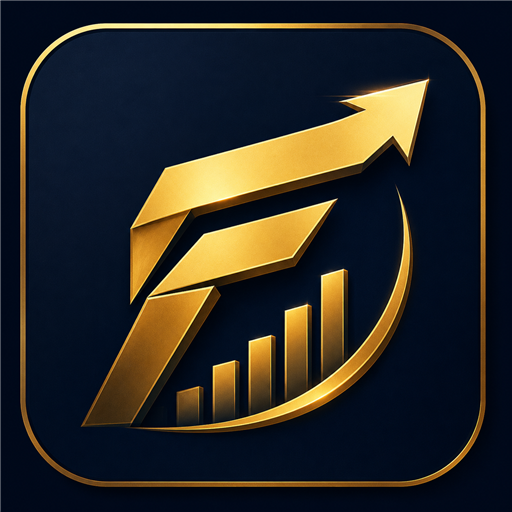
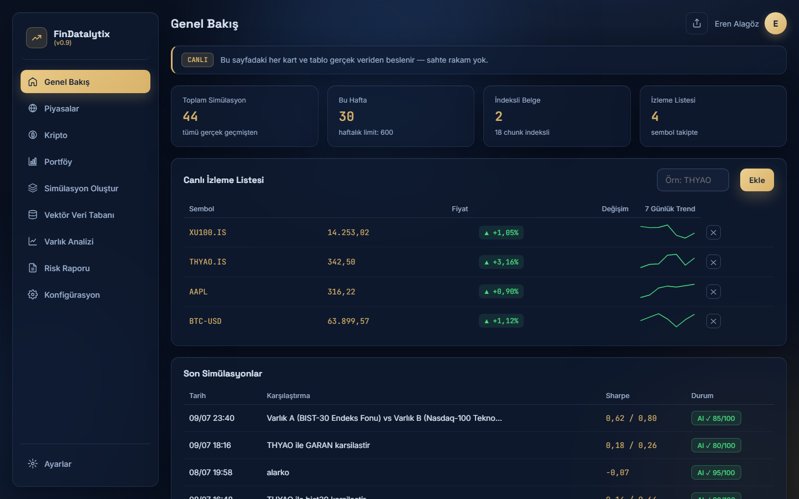
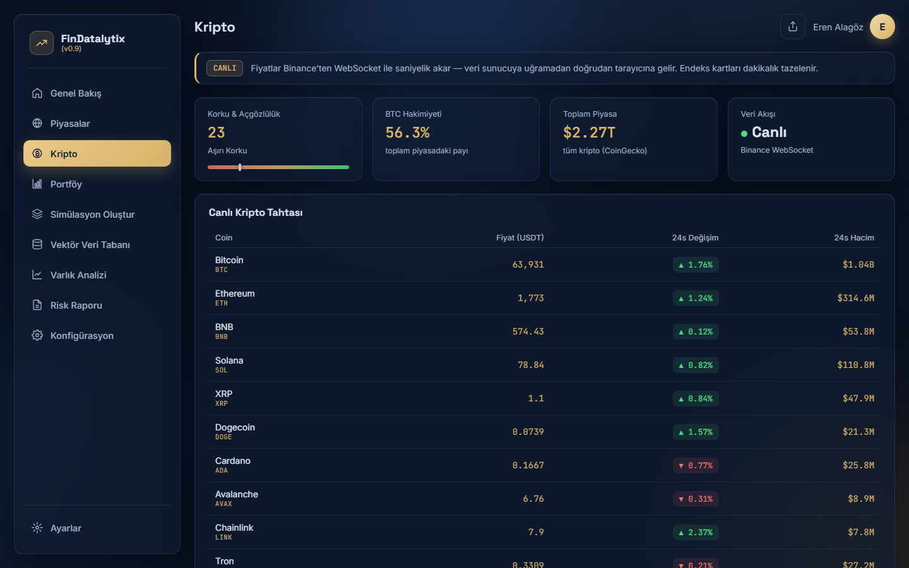
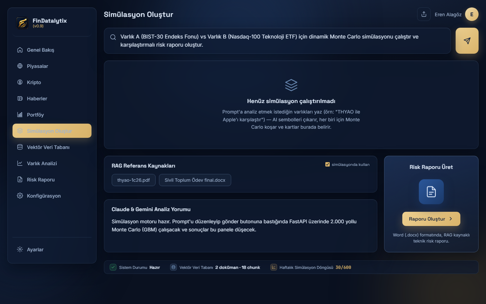
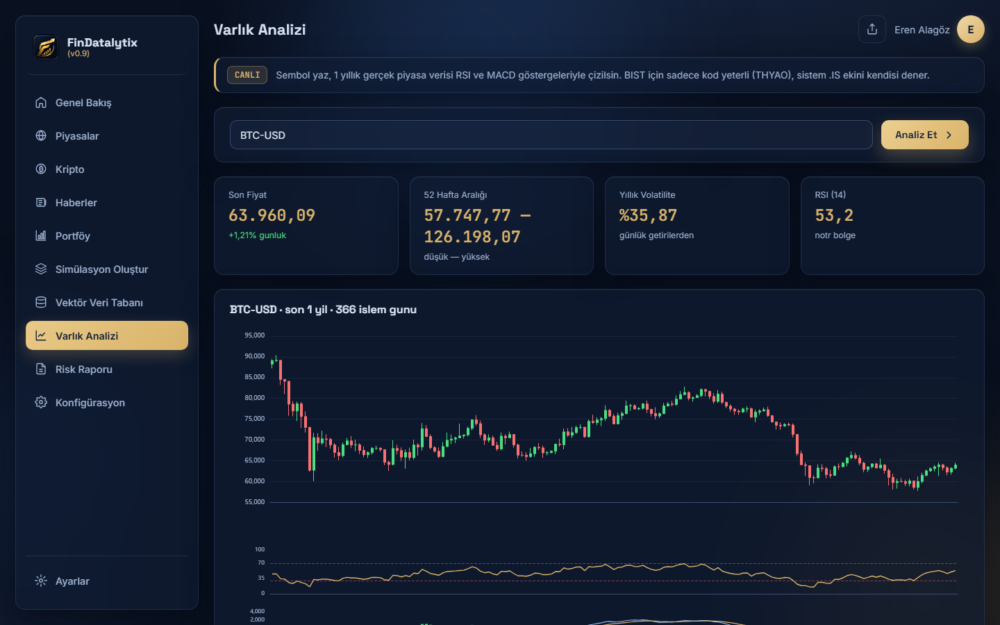
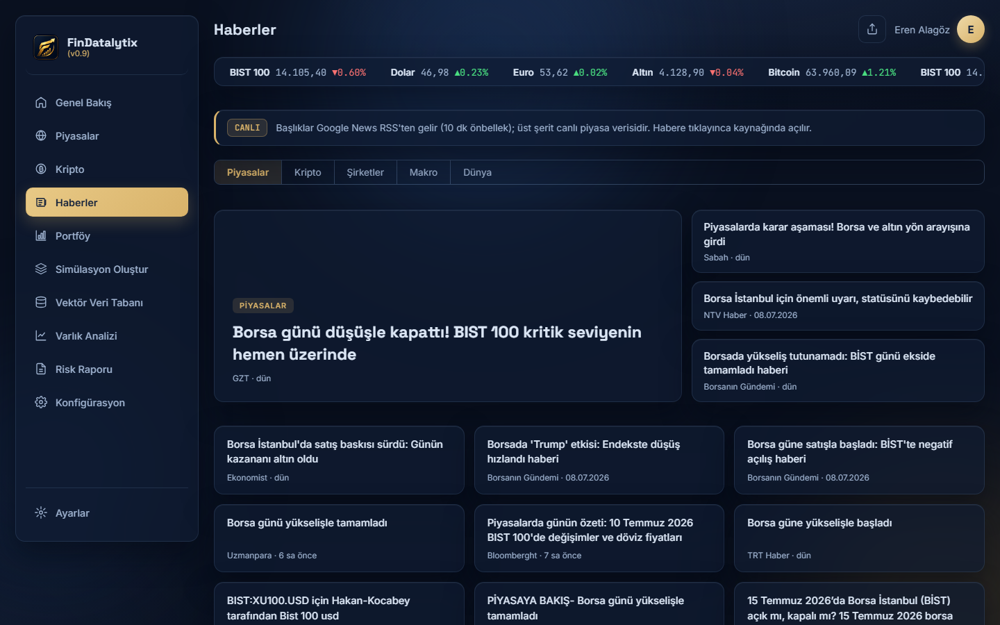

<p align="center"></p>

# FinDatalytix

**AI-assisted financial risk analysis platform** — Monte Carlo simulation, RAG-grounded document search, and a dual-AI (analyst + referee) commentary pipeline, wrapped in a real-time market dashboard.

🇹🇷 [Türkçe README](README.tr.md) · 🌐 **[Live demo → findatalytix.onrender.com](https://findatalytix.onrender.com)** *(free tier — first load may take ~1 min if the server was asleep)*

[](https://findatalytix.onrender.com)


## Screenshots

| Overview | Live crypto board (Binance WebSocket) |
|---|---|
|  |  |

| Simulation + dual-AI commentary | Technical analysis (BTC-USD) |
|---|---|
|  |  |

| News — live ticker + Google News RSS (TR/EN) |
|---|
|  |

## What it does

Type a natural-language prompt like *"compare THYAO with Apple"* — the system:

1. **Extracts tickers** from the prompt via LLM (with a deterministic fallback),
2. Pulls **2 years of real market data** (Yahoo Finance) and estimates GBM parameters (μ, σ with the Itô correction),
3. Runs a **2,000-path Monte Carlo simulation** per asset — CAGR, volatility, Sharpe, max drawdown,
4. Grounds the commentary in **your own uploaded documents** (PDF/DOCX → ChromaDB vector search),
5. Has one LLM write the analysis and a **second LLM referee it**, returning a confidence score,
6. Exports everything as a formatted **.docx risk report**.

Around that core: a live **markets board** (FX / gold / commodities / indices with sparklines and price-flash animations), a **crypto board streaming straight from Binance WebSocket to the browser** (zero server load — Fear & Greed index, BTC dominance, tick-direction coloring), per-asset **technical analysis** (candlestick + RSI + MACD, crypto included), a persistent watchlist and portfolio tracker, simulation history, TR/EN i18n, and three themes (dim / lights-out black / light).

## Architecture

```
index.html ── styles.css          glassmorphism UI, dark/light themes
config.js                         config + TR/EN dictionary (FDX namespace)
core.js                           store (single source of truth) + hash router + API layer
app.js                            render layer — one-way data flow, ECharts
        │  fetch (REST)
        ▼
backend/main.py                   FastAPI — 14 endpoints
├── market.py                     GBM parameter estimation (2y closes, 1h cache)
├── analysis.py                   OHLCV + RSI(14, Wilder) + MACD(12,26,9), .IS resolution
├── watchlist.py                  batch quotes + 7-day sparklines (55s cache)
├── rag.py                        ChromaDB store — PDF/DOCX chunking & semantic search
├── ai.py                         analyst/referee pipeline (Groq · Anthropic · Gemini)
├── report.py                     python-docx report builder
└── history.py                    simulation history (atomic writes)

engine/                           findatalytix-engine — the core being extracted
                                  into an installable library (Monte Carlo done)
```

**Design principles, enforced across the codebase:**

- **State lives in the store, not the DOM.** The frontend is a small hand-rolled unidirectional data flow: interaction → API/router → store → `render(state)`. No framework, no build step — serve the static files and it runs.
- **Graceful degradation, honestly reported.** No internet? Market data falls back to defaults and the response *admits it* (`source: "fallback"`). No API key? Commentary drops to template mode and says so in the UI.
- **Determinism.** The same prompt produces the same Monte Carlo outcome (SHA-256-derived seed) — results are reproducible.
- **Cache before courtesy.** Every Yahoo Finance touchpoint has a purpose-fit TTL (quotes 55 s, technicals 15 min, GBM params 1 h) so the app never hammers its data source.
- **Errors are data.** A bad ticker doesn't break the batch — it comes back as an `error` item and renders as a removable row.
- **RAG quality gate.** Chunks scoring below 0.50 similarity are shown to neither the user nor the model (`MIN_SCORE` in `rag.py`).

## Quickstart

```bash
# 1) Backend dependencies
cd backend
py -m pip install -r requirements.txt        # Windows
# pip install -r requirements.txt            # macOS / Linux

# 2) API keys (optional — template mode works without them)
copy .env.example .env                       # then add your key(s)
# GROQ_API_KEY=...  (free tier works)  and/or  ANTHROPIC_API_KEY / GEMINI_API_KEY

# 3) Start the API   (note: NOT --reload — it breaks .env loading on Windows)
py -m uvicorn main:app --port 8000

# 4) Serve the UI from the repo root
py -m http.server 8080     # → http://localhost:8080
```

Swagger playground: http://127.0.0.1:8000/docs

> First document upload downloads ChromaDB's ~80 MB embedding model once; allow 1–2 minutes.

## API surface

| Endpoint | Purpose |
|---|---|
| `POST /api/simulate` | LLM ticker extraction → N-asset Monte Carlo → analyst + referee commentary |
| `GET /api/asset/{symbol}` | 1y OHLCV + RSI + MACD (BIST symbols auto-resolve to `.IS`) |
| `GET /api/watchlist?symbols=` | Batch quotes: last price, daily %, 7-day sparkline |
| `POST /api/report` | Generates and downloads a .docx risk report |
| `POST /api/documents` | Upload PDF/DOCX → chunk → embed → index (ChromaDB) |
| `POST /api/query` | Semantic search over indexed documents |
| `GET /api/history` | Simulation run history |
| `GET/POST /api/settings` | Runtime configuration |
| `GET /api/ai/status` | Detected providers/keys and active analyst/referee roles |

## Tests

```bash
cd backend
python -m pytest tests -q        # 20 passed
```

Network-free by design (fake AI + fake embedder injected). Covers the simulation endpoint, RAG pipeline, document lifecycle, settings, agent behavior, and the extracted engine library.

## Deployment notes

1. **Tighten CORS:** set `CORS_ORIGINS=https://yourdomain.com` in `.env` (comma-separated for multiple origins).
2. **API:** `uvicorn main:app --host 0.0.0.0 --port 8000` behind systemd / NSSM / Docker.
3. **Frontend:** the five static files go on any static host (nginx, Vercel, GitHub Pages…); point `api.baseUrl` in `config.js` at the backend.
4. **Secrets:** `.env` never enters the repo — enforced by `.gitignore`.

## Roadmap

- Finish extracting `findatalytix-engine` (market / analysis / RAG layers)
- Provenance drawer — click any AI claim to open the exact source chunk
- One-VPS deployment recipe (Caddy + uvicorn)

## Disclaimer

Simulations and indicators are statistical models; outputs are **not investment advice**.

## License

[MIT](LICENSE) © 2026 Eren Alagöz
